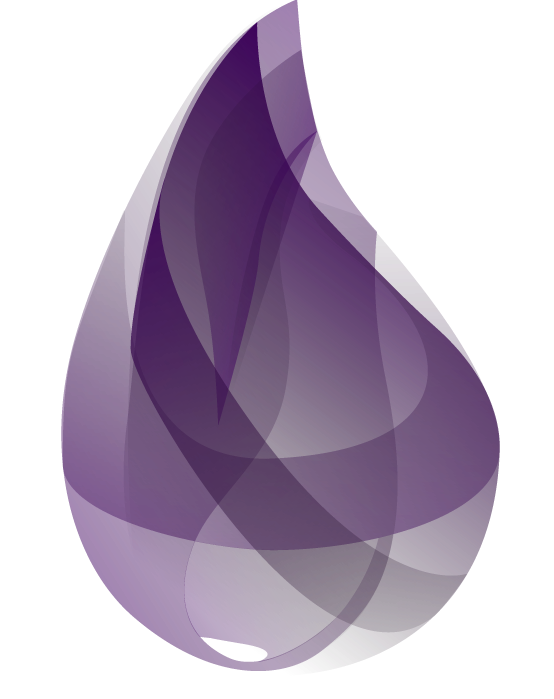

## Hello, world!

<a href="https://github.com/anuraghazra/github-readme-stats">
  <!--
  Width refers to the document's width. Using a 40% allows GitHub's iOS app to
  look decent
  -->
  
</a>

I'm Mattia, a Modelling & Simualation Engineer

- Simulation developer
- Fascinated by functional programming
- Focused on building fast & reliable software
- Interested in Machine Learning, Physics and Simulation Modelling

 

## Languages and Tools

    <!--Rust-->
    
    <!--Rocket-->
    
    <!--Yew-->
    
    <!--Python-->
    
    <!--TypeScript-->
    
    <!--Deno-->
    
    <!--Open API-->
    
    <!--Docker-->
    
    <!--Visual Studio Code-->
    
    <!--Git-->
    
    <!--GitHub-->
    
    <!--UNIX OS-->
    
    <!--Nginx-->
    
    <!--OpenFOAM-->
    

## Learn next

    <!--Apache Kafka-->
    
    <!--Apache Pulsar-->
    
    <!--Elixir-->
    
    <!--Scala-->
    
    <!--Function Mesh-->
    
    <!--OpenFaaS-->
    

